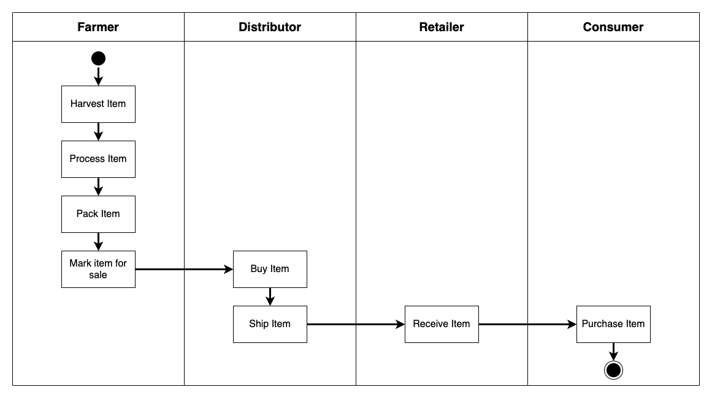
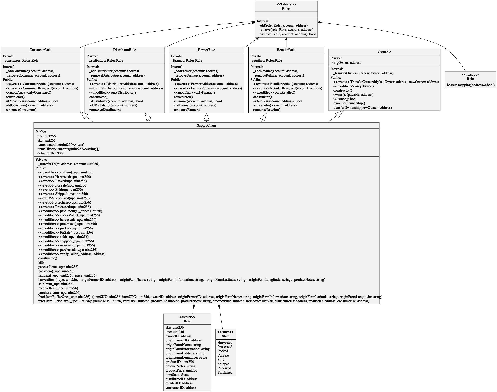
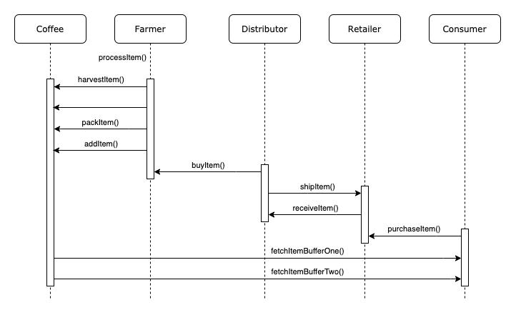
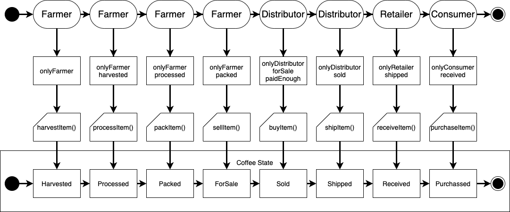

# Fair Trade Coffee

This repository containts an Ethereum DApp that demonstrates a Supply Chain flow between a Seller and Buyer.

## Tools

- Truffle v5.1.22
- solc v0.6.6
- truffle-assertions v0.9.2: Help testing event emitted in contracts
- Node 10.x

## Analysis

### Activity Diagram



### Class Diagram



### Sequence Diagram



### State Diagram



## Deployment

Contract deployed at [0x9e7062a77a566368afcb887031b26abbfdd037e1](https://rinkeby.etherscan.io/address/0x9e7062a77a566368afcb887031b26abbfdd037e1)

```
Compiling your contracts...
===========================
> Everything is up to date, there is nothing to compile.


Migrations dry-run (simulation)
===============================
> Network name:    'rinkeby-fork'
> Network id:      4
> Block gas limit: 10000000 (0x989680)


1_initial_migration.js
======================

   Replacing 'Migrations'
   ----------------------
   > block number:        6445235
   > block timestamp:     1588833951
   > account:             0x16ABCf5f4aDce39E030A8672C55D49a84AB7f50b
   > balance:             2.839654485
   > gas used:            210453 (0x33615)
   > gas price:           10 gwei
   > value sent:          0 ETH
   > total cost:          0.00210453 ETH

   -------------------------------------
   > Total cost:          0.00210453 ETH


2_deploy_contracts.js
=====================

   Replacing 'FarmerRole'
   ----------------------
   > block number:        6445237
   > block timestamp:     1588833958
   > account:             0x16ABCf5f4aDce39E030A8672C55D49a84AB7f50b
   > balance:             2.835080625
   > gas used:            430023 (0x68fc7)
   > gas price:           10 gwei
   > value sent:          0 ETH
   > total cost:          0.00430023 ETH


   Replacing 'DistributorRole'
   ---------------------------
   > block number:        6445238
   > block timestamp:     1588833964
   > account:             0x16ABCf5f4aDce39E030A8672C55D49a84AB7f50b
   > balance:             2.830769715
   > gas used:            431091 (0x693f3)
   > gas price:           10 gwei
   > value sent:          0 ETH
   > total cost:          0.00431091 ETH


   Replacing 'RetailerRole'
   ------------------------
   > block number:        6445239
   > block timestamp:     1588833970
   > account:             0x16ABCf5f4aDce39E030A8672C55D49a84AB7f50b
   > balance:             2.826465165
   > gas used:            430455 (0x69177)
   > gas price:           10 gwei
   > value sent:          0 ETH
   > total cost:          0.00430455 ETH


   Replacing 'ConsumerRole'
   ------------------------
   > block number:        6445240
   > block timestamp:     1588833976
   > account:             0x16ABCf5f4aDce39E030A8672C55D49a84AB7f50b
   > balance:             2.822160615
   > gas used:            430455 (0x69177)
   > gas price:           10 gwei
   > value sent:          0 ETH
   > total cost:          0.00430455 ETH


   Replacing 'SupplyChain'
   -----------------------
   > block number:        6445241
   > block timestamp:     1588833994
   > account:             0x16ABCf5f4aDce39E030A8672C55D49a84AB7f50b
   > balance:             2.791096245
   > gas used:            3106437 (0x2f6685)
   > gas price:           10 gwei
   > value sent:          0 ETH
   > total cost:          0.03106437 ETH

   -------------------------------------
   > Total cost:          0.04828461 ETH


Summary
=======
> Total deployments:   6
> Final cost:          0.05038914 ETH


Starting migrations...
======================
> Network name:    'rinkeby'
> Network id:      4
> Block gas limit: 10000000 (0x989680)


1_initial_migration.js
======================

   Replacing 'Migrations'
   ----------------------
   > transaction hash:    0x715c3572243d4d5db66532131bcfa45bca79a6dab673d0eba9cccd0798a20561
   > Blocks: 1            Seconds: 16
   > contract address:    0xd33789A2320B850714af334a5a4E7d17D0E04e61
   > block number:        6445239
   > block timestamp:     1588834023
   > account:             0x16ABCf5f4aDce39E030A8672C55D49a84AB7f50b
   > balance:             2.839504485
   > gas used:            225453 (0x370ad)
   > gas price:           10 gwei
   > value sent:          0 ETH
   > total cost:          0.00225453 ETH


   > Saving migration to chain.
   > Saving artifacts
   -------------------------------------
   > Total cost:          0.00225453 ETH


2_deploy_contracts.js
=====================

   Replacing 'FarmerRole'
   ----------------------
   > transaction hash:    0xed672ea9abc94b8104d27e20e7b7872e9fe7fdfa08bad5fc1c4933e4c6bbafbb
   > Blocks: 0            Seconds: 12
   > contract address:    0xEa25edf4e30244EB6671C1c4bF29de2Fb1BD1ED5
   > block number:        6445241
   > block timestamp:     1588834053
   > account:             0x16ABCf5f4aDce39E030A8672C55D49a84AB7f50b
   > balance:             2.834630625
   > gas used:            445023 (0x6ca5f)
   > gas price:           10 gwei
   > value sent:          0 ETH
   > total cost:          0.00445023 ETH


   Replacing 'DistributorRole'
   ---------------------------
   > transaction hash:    0x5cd7d11a69382b6bb92fb39386a834dcecca05096596df215ffb3d77c08ef3ab
   > Blocks: 0            Seconds: 8
   > contract address:    0x9A26d12C50Ac304E50a24c4d258F8Bf8bf4e6162
   > block number:        6445242
   > block timestamp:     1588834068
   > account:             0x16ABCf5f4aDce39E030A8672C55D49a84AB7f50b
   > balance:             2.830169715
   > gas used:            446091 (0x6ce8b)
   > gas price:           10 gwei
   > value sent:          0 ETH
   > total cost:          0.00446091 ETH


   Replacing 'RetailerRole'
   ------------------------
   > transaction hash:    0x52935075fa0020823c93b43d3bb8ecd055cf3112ecca94abc30d6c6d0a9d23bd
   > Blocks: 0            Seconds: 12
   > contract address:    0x82adCAC1790dc50E7C08AEaE1a09F122cB118Df7
   > block number:        6445243
   > block timestamp:     1588834083
   > account:             0x16ABCf5f4aDce39E030A8672C55D49a84AB7f50b
   > balance:             2.825715165
   > gas used:            445455 (0x6cc0f)
   > gas price:           10 gwei
   > value sent:          0 ETH
   > total cost:          0.00445455 ETH


   Replacing 'ConsumerRole'
   ------------------------
   > transaction hash:    0x74d2c7cb7642d26266d165b802fca19087ff4da728c0dcdc4f7c6d74f892a37e
   > Blocks: 0            Seconds: 8
   > contract address:    0x3088A587FE9BF16245902106aDa04097386bEd8c
   > block number:        6445244
   > block timestamp:     1588834098
   > account:             0x16ABCf5f4aDce39E030A8672C55D49a84AB7f50b
   > balance:             2.821260615
   > gas used:            445455 (0x6cc0f)
   > gas price:           10 gwei
   > value sent:          0 ETH
   > total cost:          0.00445455 ETH


   Replacing 'SupplyChain'
   -----------------------
   > transaction hash:    0x0800a3869de036b4594566b9a3fedfef4f234ca56ec5d79d1d03988278a5e2a1
   > Blocks: 0            Seconds: 8
   > contract address:    0x9E7062A77A566368AfcB887031B26AbbFdD037e1
   > block number:        6445245
   > block timestamp:     1588834113
   > account:             0x16ABCf5f4aDce39E030A8672C55D49a84AB7f50b
   > balance:             2.789146245
   > gas used:            3211437 (0x3100ad)
   > gas price:           10 gwei
   > value sent:          0 ETH
   > total cost:          0.03211437 ETH


   > Saving migration to chain.
   > Saving artifacts
   -------------------------------------
   > Total cost:          0.04993461 ETH


Summary
=======
> Total deployments:   6
> Final cost:          0.05218914 ETH
```
